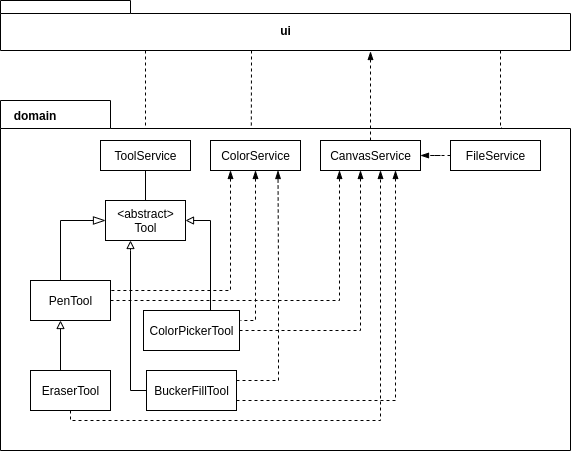
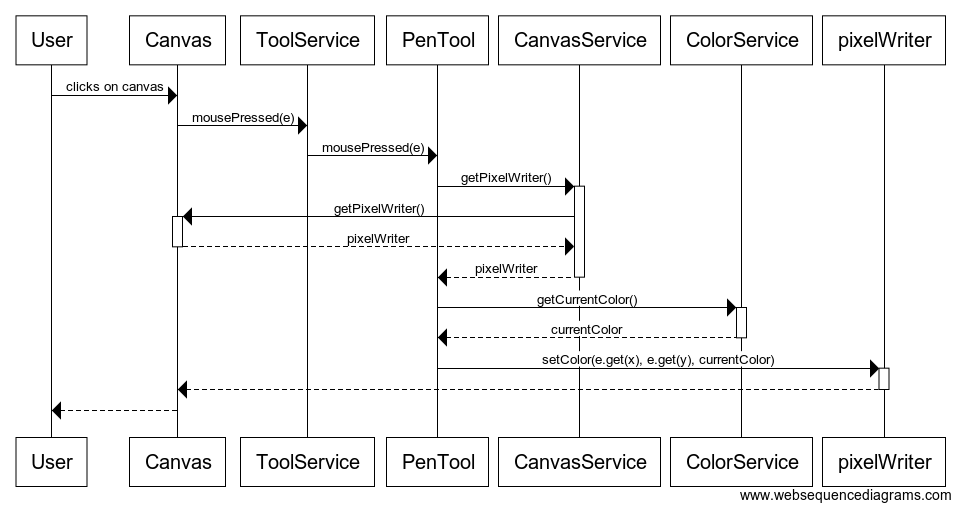
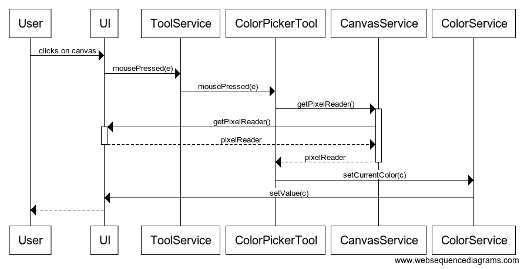

# Arkkitehtuurikuvaus

## Pakkausrakenne

Pakkaus *pixeleditor.ui* sisältää JavaFX:llä toteutetun käyttöliittymän ja *pixeleditor.domain* sisältää sovelluslogiikan.

## Käyttöliittymä

Käyttöliittymä koostuu yhdestä päänäkymästä ja dialogi-ikkunoista. Käyttöliittymän koodi on jaettu useampaan luokkaan.

- *ColorChooser* käärii JavaFX:n *ColorPicker*-olion ja yhdistää sen *ColorService*-luokkaan.
- *FileChoosers* käärii sisäänsä useita JavaFX:n *FileChooser*-luokkia, joita käytetään tiedoston avaamiseen ja tallentamiseen. *FileChooser*-luokille asetetaan konstruktorissa sopivat tiedostopäätteet. Metodi *getSelectedExtensionAsString* palauttaa viimeksi valitun tiedostopäätteen kirjainosan.
- *NewImageDialog* määrittelee uuden kuvan luomiseen käytettävän ikkunan.
- *PixelEditorUi* määrittää päänäkymän, joka sisältää piirtoalueen, työkalupalkin ja ylävalikon.
- *ToolButton* perii JavaFX:n *ToggleButton*-luokan. Tavallisen toiminnallisuuden lisäksi luokan oliot tietävät, mille työkalulle ne kuuluvat.

Piirtoalue on määritelty JavaFX:n *Canvas*-olion avulla.

Käyttöliittymä on pyritty eristämään sovelluslogiikasta, mutta sovelluksen luonteesta johtuen sovelluslogiikka on jossain määrin riippuvainen käyttöliittymän *Canvas*-olioista. Pääsyä olioihin on kuitenkin yritetty rajoittaa *CanvasService*-luokan avulla, jonka metodeilla niitä voi muokata.

## Sovelluslogiikka

Sovelluslogiikka koostuu useista eri luokista, joilla on omat vastuualueensa.

Staattinen luokka *CanvasService* tarjoaa metodeja, jotka antavat muille sovelluslogiikan luokille rajoitetun pääsyn käyttöliittymän eri piirtotasoja kuvaavia *Canvas*-olioita. Esimerkiksi eri työkalut voivat muokata sen avulla piirtoaluetta.

Staattinen luokka *ColorService* tarjoaa metodeja, joilla voi hakea ja asettaa valittuna olevan värin. Luokka sisältää myös tiedon käyttöliittymän *ColorPicker*-oliosta ja huolehtii, että sen väriarvo pysyy synkronoituna.

Luokan *FileService* ainoa olio huolehtii tiedostojen hallinnasta. Sen vastuulla on piirtoalueen sisällön viemisestä eri tiedostomuotoihin ja kuvatiedostojen sisällön tuominen piirtoalueeseen.

Luokan *ToolService* ainoa olio pitää kirjaa valittuna olevasta työkalusta ja ohjaa piirtoaluetta koskevat hiiritapahtumat valittuna olevalle työkalulle.

Luokka/pakkauskaavio:

### Työkalut

Työkalu on määritelty abstraktissa luokassa *Tool*. Jokaisella työkalulla on metodit:

- mousePressed(MouseEvent e)
- mouseDragged(MouseEvent e)
- mouseReleased(MouseEvent e)

Metodeissa määritellään kyseisen työkalun toiminta, kun hiirtä käytetään piirtoalueella. Jokaisella työkalulla on myös tieto kuvakkeensa nimestä, joka näytetään työkalupalkissa. Kuvatiedostot löytyvät kansiosta *src/main/resources/images/*

#### Kynätyökalu

Kynätyökalu on toteutettu luokassa *PenTool*. Kun työkalupalkista on valittuna kynätyökalu, niin piirtoalueelle klikkaamisen jälkeen sovelluksen kontrolli etenee seuraavasti:

Piirtoalueen tapahtumankäsittelijä kutsuu työkalupalvelun *ToolService* metodia *mousePressed*, joka ohjaa hiiritapahtuman valittuna olevalle työkalulle, joka on kuvatussa tilanteessa kynätyökalu. Kynätyökalu tarvitsee PixelWriter-olion, jolla piirtoaluetta voi muokata. Tämän se hakee piirtoalueelta *CanvasService*-luokan kautta. Kynätyökalu tarvisee myös tiedon valittuna olevasta väristä, jonka se kysyy väripalvelulta *ColorService*. Muokattavan pikselin koordinaatit kynätyökalu saa selville parametrina saamastaan hiiritapahtumasta. Sitten kynätyökalu kutsuu PixelWriter-olion *setColor*-metodia, jolloin piirtoalue päivittyy ja muutos näkyy käyttäjälle.

Kun hiirtä raahaa piirtoalueella, niin työkalun toiminta muuttuu hieman. Teknisistä syistä johtuen hiiritapahtumia ei rekisteröidä jokaisen kuljetun pikselin kohdalla, jos hiirtä liikuttaa tarpeeksi nopeasti. Käyttäjät kuitenkin olettavat, että tuloksena olisi yhtenäinen viiva. Tämän takia sovellus tallettaa tiedon hiiritapahtumasta, jos se on tyyppiä MOUSE_DRAGGED. Seuraavan hiiritapahtuman saapuessa sovellus piirtää viivan uuden ja vanhan pisteen välille Bresenhamin viiva-algoritmin avulla. Bresenhamin algoritmista löytyy lisätietoja Wikipediasta: https://en.wikipedia.org/wiki/Bresenham%27s_line_algorithm

#### Pyyhekumi

Pyyhekumi on toteutettu luokassa *EraserTool*. Pyyhekumi on erikoistapaus kynätyökalusta, jossa käytetty väri on kaikissa tapauksissa läpinäkyvä. Toteutus on siten suurelta osin peritty luokalta *PenTool*.

#### Pipetti

Pipettityökalu on toteutettu luokassa *ColorPickerTool*. Kun työkalupalkista on valittuna pipettityökalu, niin piirtoalueelle klikkaamisen jälkeen sovelluksen kontrolli etenee seuraavasti:

Piirtoalueen tapahtumankäsittelijä kutsuu työkalupalvelun *ToolService* metodia *mousePressed*, joka ohjaa hiiritapahtuman valittuna olevalle työkalulle, joka on kuvatussa tilanteessa pipettityökalu. Pipettityökalu tarvitsee *PixelReader* -olion, jolla piirtoalueen pikseleitä voi lukea. Tämän se hakee piirtoalueelta *CanvasServicen* kautta. Sitten pipettityökalu kutsuu *ColorService*-luokan metodia *setCurrentColor*, joka päivittää valittuna olevan värin. *ColorService* kutsuu JavaFX:n *ColorPicker*-olion metodia *setValue*, jolloin värin vaihtuminen päivittyy myös käyttöliittymässä.

#### Värin valinta

Värin valinta käyttää JavaFX:n valmista ColorPicker-luokkaa.

#### Sankkotäyttö

Sankkotäyttö käyttää jonoon perustuvaa *flood-fill*-algoritmin toteutusta. Algoritmista löytyy lisätietoja Wikipediasta: https://en.wikipedia.org/wiki/Flood_fill

### Pysyväistallennus

Projektin tallennusformaatti on ZIP-tiedosto, joka sisältää piirtotasot PNG-kuvaformaatissa. Näiden kuvatiedostojen nimet ovat numeroitu alkaen nimestä *layer0.png*. Tasot voi myös litistää yhdeksi kuvatiedostoksi, jonka formaatti voi olla PNG, BMP, GIF tai TIFF.

## Ohjelman rakenteeseen jääneet heikkoudet

Ohjelmassa on kohtuullinen verran kovakoodattuja arvoja ja erityisesti tasosysteemin toteutus on hyvin jäykkä. Mahdollinen jatkokehitys vaatii paljon refaktorointia.