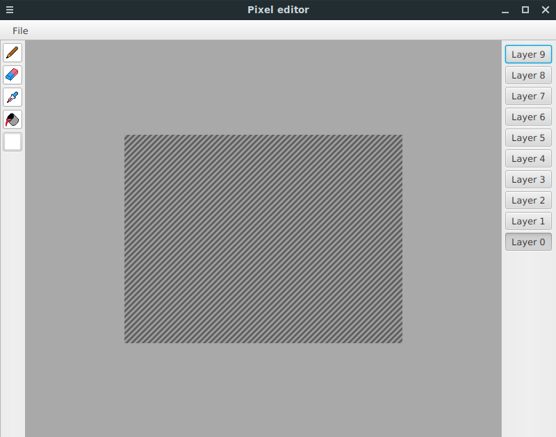

## Käyttöohje

Sovellus käynnistyy päänäkymään, joka näyttää tällä hetkellä seuraavalta:

Keskellä on piirtoalue, jonka koko on oletuksena 300 pikseliä leveä ja 200 pikseliä korkea. Piirtoalueen tausta näyttää toistaiseksi valkoiselta, mutta oikeasti se on läpinäkyvä. Piirtoaluetta voi muokata valitsemalla vasemmasta laidasta olevasta työkalupalkista haluamansa työkalun ja klikkaamalla tai raahaamalla hiirtä piirtoalueella. Hiiren oikealla napilla ei ole toistaiseksi mitään toiminnallisuutta. Työkalut ovat:

- **Kynätyökalu**: piirtää yhden pikselin (koko ei tällä hetkellä muokattavissa) levyisen viivan valitulla värillä.
- **Pyyhekumi**: pyyhkii yhden pikselin (koko ei tällä hetkellä muokattavissa) levyisen viivan läpinäkyväksi.
- **Pipetti**: valitsee klikatun pikselin värin nykyiseksi väriksi.
- **Sankkotäyttö**: muuttaa klikatun pikselin ja sitä ympäröivät saman väriset pikselit valitun värisiksi.
- **Värin valinta**: avaa dialogin, josta voi valita värin.

Yläpalkista löytyy pudotusvalikko nimeltään *File*, jonka sisältämät toiminnallisuudet ovat:

- **New**: Luo uuden kuvan, jonka mittasuhteet voi valita avautuvasta dialogista. Luomisen voi perua painamalla *Cancel* ja hyväksyä painamalla *Create*. Kun uusi kuva luodaan, niin vanha kuva katoaa kysymättä käyttäjältä, olisiko hän mahdollisesti halunnut tallentaa sitä.
- **Import from...**: Tuo kuvan sovellukseen. Avattava kuvatiedosto valitaan tiedostojärjestelmän dialogista. Tuettuja tiedostomuotoja ovat PNG, BMP ja GIF. Jos tiedostoa ei voi avata, niin (toivottavasti) mitään ei tapahdu. Kun kuva tuodaan sovellukseen, niin vanha kuva katoaa kysymättä käyttäjältä, olisiko hän mahdollisesti halunnut tallentaa sitä.

- **Export to..**: Vie sovelluksen haluttuun tiedostomuotoon. Tuettuja tiedostomuotoja ovat PNG, BMP, GIF ja TIFF. Tiedostomuoto valitaan ensisijaisesti valitun tiedostonimen päätteestä. Jos tiedostopäätteen haluaa Linux-henkisesti jättää pois, niin tiedostomuodon voi valita oikeassa alakulmassa olevasta pudotusvalikosta. BMP- ja GIF -formaatit eivät tue täyttä läpinäkyvyyttä, joten sovellus täyttää läpinäkyvät osuudet magentan värisiksi. Tämä tapahtuu kysymättä käyttäjältä mitään. Jos tiedoston tallennuksen aikana tapahtuu jokin ongelma, niin käyttäjälle ei myöskään kerrota mitään.

- **Exit**: Sulkee sovelluksen sen kummempia kyselemättä. Tallenna muutokset ennen sulkemista!