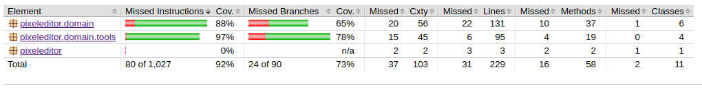

# Testausdokumentti

Ohjelma testaus on toteutettu automatisoiduilla yksikkö- ja integraatiotesteillä JUnitia käyttäen. Järjestelmätason testaus on toteutettu manuaalisesti.

## Yksikkö- ja integraatiotestaus

### Sovelluslogiikka

Suurin osa sovelluslogiikan testeistä käyttävät *JavaFX JUnit-4 Testrunner*- kirjastoa, jonka avulla *@TestInJfxThread* annotaatiolla merkityt testit suoritetaan JavaFX-säikeessä. Tämä mahdollistaa esimerkiksi *Canvas*-olion käsittelyn testien aikana.

Luokassa [FileServiceTest](https://github.com/tapanih/ot-harjoitustyo/blob/master/pixeleditor/src/test/java/pixeleditor/domain/FileServiceTest.java) testataan tiedostojen käsittelyä. Luokka testaa kuvatiedostojen avaamista käyttämällä kansiossa *src/test/resources/images* sijaitsevia kuvatiedostoja. Testauksessa käytettävät tilapäiset tiedostot luodaan JUnitin [TemporaryFolder](https://junit.org/junit4/javadoc/4.12/org/junit/rules/TemporaryFolder.html) -säännön avulla.

Luokissa [BucketToolTest](https://github.com/tapanih/ot-harjoitustyo/blob/master/pixeleditor/src/test/java/pixeleditor/domain/tools/BucketFillToolTest.java), [ColorPickerToolTest](https://github.com/tapanih/ot-harjoitustyo/blob/master/pixeleditor/src/test/java/pixeleditor/domain/tools/ColorPickerToolTest.java), [EraserToolTest](https://github.com/tapanih/ot-harjoitustyo/blob/master/pixeleditor/src/test/java/pixeleditor/domain/tools/EraserToolTest.java) ja [PenToolTest](https://github.com/tapanih/ot-harjoitustyo/blob/master/pixeleditor/src/test/java/pixeleditor/domain/tools/PenToolTest.java) testataan eri työkalujen toimintaa. Luokissa määritellyt testit ovat suurimmaksi osaksi integraatiotestejä, jotka hyödyntävät ja testaavat luokkia [CanvasService](https://github.com/tapanih/ot-harjoitustyo/blob/master/pixeleditor/src/main/java/pixeleditor/domain/CanvasService.java) ja [ColorService](https://github.com/tapanih/ot-harjoitustyo/blob/master/pixeleditor/src/main/java/pixeleditor/domain/ColorService.java). Näille luokille ei ole tämän takia määritelty omia testiluokkia.

Luokkaa [ToolService](https://github.com/tapanih/ot-harjoitustyo/blob/master/pixeleditor/src/main/java/pixeleditor/domain/ColorService.java) ei testata tällä hetkellä ollenkaan.

### Testikattavuus

Käyttöliittymää lukuunottamatta sovelluksen rivikattavuus on 92% ja haaraumakattavuus on 73%.

## Järjestelmätestaus

Sovelluksen järjestelmätestaus on suoritettu manuaalisesti käymällä läpi määrittelydokumentissa ja käyttöohjeessa listatut toiminnallisuudet.

## Sovelluksen laatuongelmat

Sovelluksen antamat virheilmoitukset eivät ole kovin kuvaavia. Projektin avaaminen tulostaa varoituksen, joka tulee jostain Javan syövereistä.